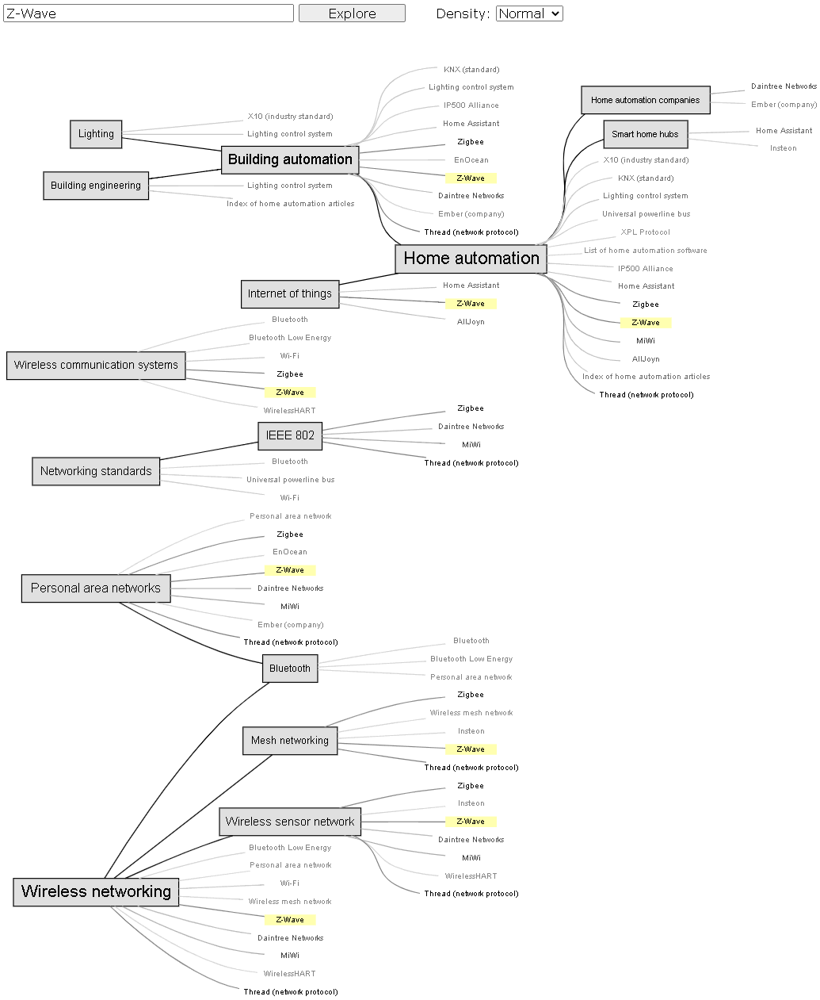

# [See it in action](https://lowlight-ua.github.io/wikipedia_explorer/src/index.html)

# Introduction

The Wikipedia explorer tool automatically creates a map of relevant concepts, when seeded by a name of a Wikipedia article. It uses Wikipedia articles and categories to build a knowledge graph. 

The tool can be used when researching a topic, deepening the knowledge of something you already have, or going down rabbit holes.

Example:

# How it works

The tool works in a browser and does not have a back-end. It uses [Wikimedia API](https://www.mediawiki.org/wiki/API:Main_page) of the [English Wikipedia](https://en.wikipedia.org/). When given a Wikipedia article name, it makes a series of API calls to discover relevant articles, associated categories, and various attributes thereof. After ranking the articles and categories, it discards less relevant ones, and builds a knowledge graph using the [Graphviz](https://graphviz.org/) engine.

A related article appears multiple times in the graph, because articles are attached to every category they pertain to.

# Implementation notes

I am not a JavaScript developer, and got a quick grasp on ECMAScript 6 just for the purposes of this toy project. The code might not reflect the established best practices for the language.
